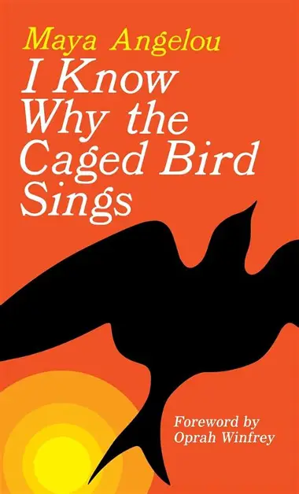

## *I Know Why The Caged Bird* Sings Analysis
# By Allie Peterson 

[Link to the poem](https://internetpoem.com/maya-angelou/i-know-why-the-caged-bird-sings-poem/)

 

Within my English classes over the years, Maya Angelou has been a recurring name throughout the texts we had to read. I found myself being drawn to her writing as it speaks for those who cannot, giving them a platform. She writes for those who, as she states in her text, are “caged birds”. These caged birds are symbolized as African Americans who have been discriminated against and silenced throughout world history. This is the exact topic she is writing about within her book I Know Why The Caged Bird Sings. This poem is excerpted from the book and is known as a powerful message not only now but mainly during the time of the civil war. The poem's main purpose is to inform African Americans that she will give them a voice, along with showing the contrasts between freedom and oppression. She emphasizes the power of the human spirit and how even a caged bird, who should have no hope, perseveres and continues to sing. Throughout all the metaphors and figurative language, she is still addressing the racial injustices African Americans face in America and putting it in the light through public speech. This direct message of visibility and strength creates a powerful bond between her and the reader while also challenging their oppressors. 

**Maya Angelou** uses 
* metaphors
* allusion
* repetition

in I Know Why the Caged Bird Sings to underscore the physiological and emotional effects of racial discrimination, while empowering African Americans simultaneously by giving voice to their struggle and highlighting the human spirit's eternal resilience.

This poem is a direct form of speech to African Americans during the civil war. Speaking to those who have been oppressed or who experienced the feeling of being trapped in society, she is showing how she relates with them, as an African American, and showing them hope throughout the text. By doing so, Angelou not only validates the truly lived experiences of her primary audience but she is also reclaiming the space for African Americans voices in America.  While reading, I feel I am the secondary audience because I am reading seeking awareness on the subject and looking to learn and expose my eyes to the privilege I have. As a secondary reader, I feel she is trying to show the emotional and psychological impacts that many have faced in the eyes of oppression. She conveys a message clearly with African Americans when she states, “But a caged bird stands on the grave of dreams/ His shadow shouts on a nightmare scream” (Angelou).  These lines show a direct form of speech to African Americans because she is using imagery of the “grave of dreams” as a reflection of all the denied opportunities that have been generational. In history, African Americans have been enslaved, denied health care, denied jobs, denied basic human rights, ect.,all because the color of their skin isn't white. The imagery of being confined directly correlates to her caged bird metaphor. The excluded audience is those who live with privilege or without awareness of oppression. With such focus on the reality African Americans live, these experiences do not relate to white people because we have always lived freely. They are not being directly spoken too throughout the poem, with the exception of the free bird, which only is spoken about in moderation. However, for her secondary audience, Angelou is presenting them with a metaphorical mirror in the poem, this mirror is reflecting their privilege which will enevidably challenge them to use empathy and self-reflection.

The main rhetorical strategies used within the poem are allusion, repetition, and metaphors. Allusions are a form of figurative language where the writer indirectly is speaking about a topic or group of people without ever fully mentioning who it is. Angelou uses this throughout the whole poem by mentioning the caged bird and its experiences. The use of allusion with appeal to many groups of people with their shared culture which she is doing for African Americans. Alluding to African Americans only strengthens her rhetorical language because it is making her audience more completed to read and understand what she is talking about. This is also why metaphors are used. Metaphors strengthen her ideas and the heaviness of her message because she is showing what the caged bird goes through. While her 1st audience is reading, they will start to relate and uncover her metaphors to see that they relate to their own experiences. The readers are emotionally connected to the poem and see connections with their experiences of being trapped and trying to find hope in a seemingly hopeless world. Many African Americans have experienced these feelings first hand, so the metaphors will speak fluently to them. The repetition within the poem holds strong power because the ideas are being constantly conveyed into your mind while reading. Angelou is incorporating a rhythmic emotional potency that will continue to sing throughout the reader's ears. Using the idea that the caged bird will continue to sing is echoing hope upon the reader that reinforced a central image. She is highlighting the struggles African Americans face within society while also showing how persitiant the human spirit can be. The poem's structure and language are intentionally simple and linguistic, allowing it to reach a wide audience, which allows Angelou to reach her goal of public expression.

Within Maya Angelou’s poem she uses metaphors, allusion, and repetition in I Know Why the Caged Bird Sings to underscore the physiological and emotional effects of racial discrimination, while empowering African Americans simultaneously by giving voice to their struggle and highlighting the human spirit's eternal resilience. I believe that this text is a strong example of public writing because, not only the way it's taught in many schools but also because of how it makes a lasting impact for the reader. The poem raises awareness for social justice and what African Americans have had to go through on an emotional and political aspect. Angelou inspires and empowers readers while also asking for change and a better world where the caged bird can be let free. I also feel her use of rhetorical language throughout the poem is one of the strongest elements because while you are reading you can feel her persuasion leaking into your brain. There is so much to dissect and understand about the text that makes it a strong form of rhetorical writing. Most importantly, the poem succeeds because it brings the unseen view into the light, by taking private suffering and turning into a feeling of justice and freedom. In today's society, sadly, oppression has still persevered and has expanded across ethnicities where this poem could be moved to other communities. However, I feel for the time it was written, the audience it was intended for was perfect and needed. Her poem instilled action among others along with reflection for America during a time where voices were being silenced. The poem henceforth has made a lasting impact. By blending emotional truth with rhetoric, Angelou’s poem continues to relate to readers across all backgrounds, offering healing and self-reflection.

# Brief analysis 

